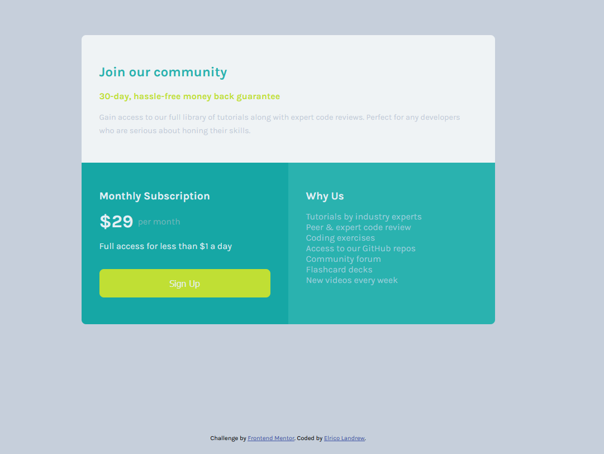

# Frontend Mentor - Single price grid component

## The challenge

Your users should be able to:

- View the optimal layout for the component depending on their device's screen size
- See a hover state on desktop for the Sign Up call-to-action

## Deploying your project

As mentioned above, there are many ways to host your project for free. Our recommend hosts are:

- [GitHub Pages](https://github.com/teddy-wests1de/single-price-grid-component)
- [Netlify](https://gentle-bonbon-d12700.netlify.app/)
